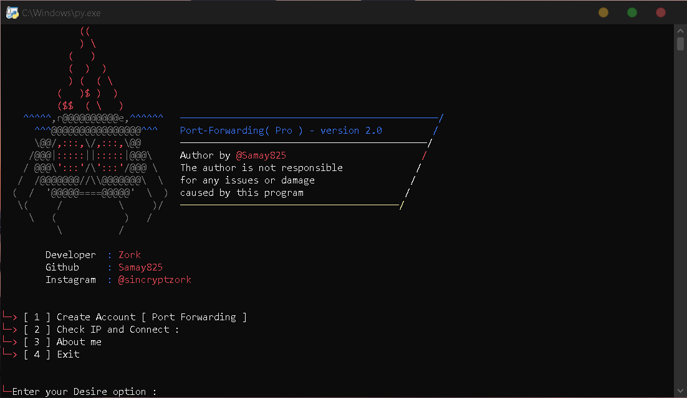

# Static-IP-Automation Script 
 

- What is Static-Ip Automation Version System  ?
> This is Static ip generator permanent it generates tcp ip and port.
> Many times you just want to spy permanent with spynote or spynote with this ip you can.
> If you find yourself in that situation then this Static-ip Automation is the perfect tool for you!
> You can connect ip with 1 sec. This awesome script works with every operator/carrier.
> this tool made by @samay825 

 

- Static-IP Automation Version features 

* `Creates Your personal account permanent.`

* `Supports newest Android also but script works only in windows.`

* `Instant Tcp connection 1secs.`

* `Working with all Operators/Carriers.`

* `No missing IP issues, all Tcp connection will be persistence.`

*  For Contact Instagram me: sincryptzork

 

- Support

> `Windows only for linux just wait..`

> `Works in all windows only requires python3.`

> `ffbonline.com and more threads.`
 
  

- Installation & Step's
 
> `apt update && apt upgrade`
 
> `git clone https://github.com/samay825/Static-IP-Automation`
 
> `cd Static-IP-Automation`  

> `notice : windows must be little bit fast`
 
> `python3 main.py`

 

<h3>Visitors :</h3>
 

